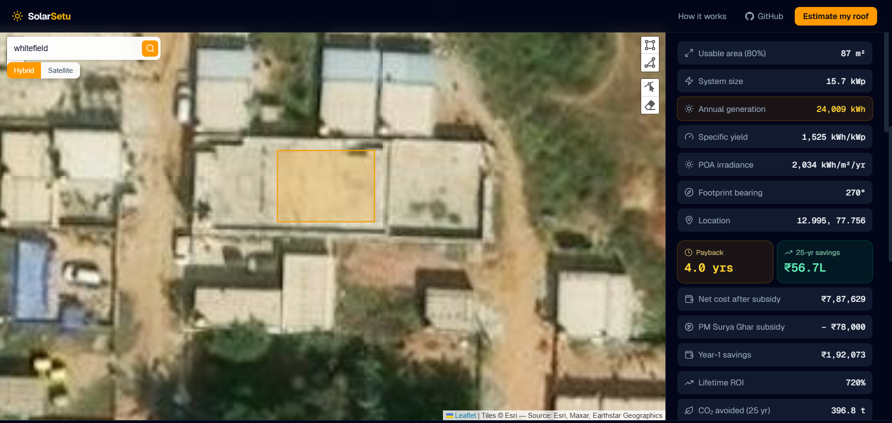

<div align="center">

# ☀️ SolarSetu

### Draw your roof on a satellite map. Get your solar payback in seconds.

A rooftop solar ROI estimator for India that models the **actual physics** — NASA satellite
irradiance, panel tilt & orientation, real shading — and the **actual policy**: the
PM Surya Ghar subsidy, net metering, and 25 years of tariffs and panel aging.

<br/>

**[🚀 Try it live → solarsetu.vercel.app](https://solarsetu.vercel.app)**

<br/>


</div>

---

## 🎬 See it in 30 seconds

1. Open **[solarsetu.vercel.app](https://solarsetu.vercel.app)** — or just hit **"Try a sample roof in Delhi"**
2. Search your address, then **trace your rooftop** on the satellite imagery
3. Instantly get: system size (kWp), monthly generation, the **PM Surya Ghar subsidy**, net cost, **payback period**, and 25-year savings
4. Tall building next door? **Mark it** — SolarSetu simulates the sun's path hour-by-hour and tells you exactly what that shadow costs you, month by month

> *"The 6 m building to your south costs you 22% of your direct sun in December — but only 3% in June."* That's the level of answer this gives.

---

## 🤔 Why another solar calculator?

Because most "solar calculators" are a spreadsheet behind a form: you type your bill, they multiply by a magic number. SolarSetu models the system:

- 🛰️ **Your roof's real sunlight** — NASA POWER climatology fetched for the roof's exact coordinates, not a city average
- 📐 **Real transposition physics** — the Liu–Jordan isotropic model converts horizontal irradiance into what your *tilted, oriented* panels actually receive
- 🏢 **Shading without 3D city data** — India has no open building-height dataset, so SolarSetu inverts the problem: *you* mark the tall neighbour, and a horizon-profile + sun-path simulation does the rest
- 🇮🇳 **The subsidy engine** — PM Surya Ghar tiers (₹30k/kW → ₹78k cap), optional state top-ups, 1:1 net metering
- 📈 **Honest 25-year finance** — tariff escalation grows your savings, panel degradation shrinks them, payback is interpolated to the fraction of a year
- 🔍 **Transparent by design** — every assumption (tilt, azimuth, performance ratio, tariff, cost…) is a visible, adjustable slider. The estimate is auditable, not a black box.

<!-- Screenshot: docs/screenshot.png — a traced roof + results sidebar

-->

---

## 🏗️ How the model works

```
Drawn roof polygon
      │  Turf.js — geodesic area + centroid + orientation hint
      ▼
Roof geometry ──► NASA POWER API (monthly GHI + diffuse for that exact point)
      │                    │
      │   Liu–Jordan isotropic transposition (tilt, azimuth, latitude)
      │   × horizon-profile shading (user-marked obstructions)
      ▼                    ▼
Plane-of-array irradiance (kWh/m²/yr)
      │   E = kWp × POA × Performance Ratio
      ▼
Annual + monthly generation (kWh)
      │   PM Surya Ghar subsidy · net metering · escalation · degradation
      ▼
Net cost · payback · 25-yr ROI · CO₂ avoided
```

### 🏢 The shading engine (the fun part)

Professional tools need 3D city models. India doesn't have one. So instead:

1. You outline the nearby building/tree and say how much taller than your roof it is *(1 floor ≈ 3 m)*
2. SolarSetu builds a **horizon profile** — the skyline elevation angle in all 72 compass directions (5° bins)
3. It then **simulates the sun's position every 10 minutes** across a representative day of each month
4. Whenever the sun dips below your skyline, its direct beam is blocked — weighted by intensity, summed per month
5. The result feeds straight into the physics — and the UI shows the annual loss and your worst month

A north-side obstruction correctly costs you ~nothing (the sun never goes there in India) — no special-casing, the geometry just works.

### ✅ Validated, not vibes

- Delhi benchmark: the model yields **~1,417 kWh/kWp/yr** vs the published real-world **1,450–1,550** — deliberately a touch conservative, as a financial estimate should be
- **29 Vitest tests** assert physical invariants: a flat panel's POA must equal GHI *exactly*, east-facing must lose to south-facing, a southern wall must hurt December more than June, subsidy tiers at every boundary
- Every model function is pure TypeScript with zero UI dependencies

---

## 🛠️ Tech stack

| Layer | Tech |
|---|---|
| Framework | Next.js 16 (App Router) · React 19 · TypeScript · Tailwind CSS v4 |
| Map & drawing | React-Leaflet · Leaflet-Geoman · Esri World Imagery (keyless) |
| Geospatial math | Turf.js (geodesic area, centroid, bearings) |
| Solar data | NASA POWER climatology API (free, global, keyless) |
| Geocoding | OpenStreetMap Nominatim (keyless) |
| Charts | Recharts |
| Tests | Vitest — 29 tests over the solar, shading & finance models |
| Hosting | Vercel — **$0/month, zero API keys anywhere** |

---

## 🚀 Run it locally

```bash
git clone https://github.com/ProDeveloperAditya/solarsetu.git
cd solarsetu
npm install
npm run dev      # → http://localhost:3000
npm test         # run the 29 model tests
```

No API keys, no environment variables, no accounts. Clone → install → run.

---

## 📁 Project structure

```
lib/
├── solar.ts      Liu–Jordan transposition, production model   (pure, tested)
├── shading.ts    Horizon profile + sun-path simulation        (pure, tested)
├── finance.ts    PM Surya Ghar subsidy, payback, 25-yr ROI    (pure, tested)
└── geometry.ts   Drawn polygon → area, centroid, bearing
app/api/irradiance/   NASA POWER proxy (CORS + 24h cache + data validation)
components/           RoofMap (draw), RoofEstimator (orchestration), charts, landing
__tests__/            29 Vitest tests asserting physical invariants
```

---

## ⚖️ Disclaimer

SolarSetu produces an informational estimate from climatological averages and public subsidy rules — not a professional site survey or financial advice. Actual generation, costs, and subsidies vary by site, vendor, DISCOM, and current policy.

---

<div align="center">

Built by **[Aditya Raj](https://github.com/ProDeveloperAditya)** · [LinkedIn](https://www.linkedin.com/in/aditya-raj-developer/)

If this saved you a call with a pushy solar salesman, leave a ⭐

</div>
